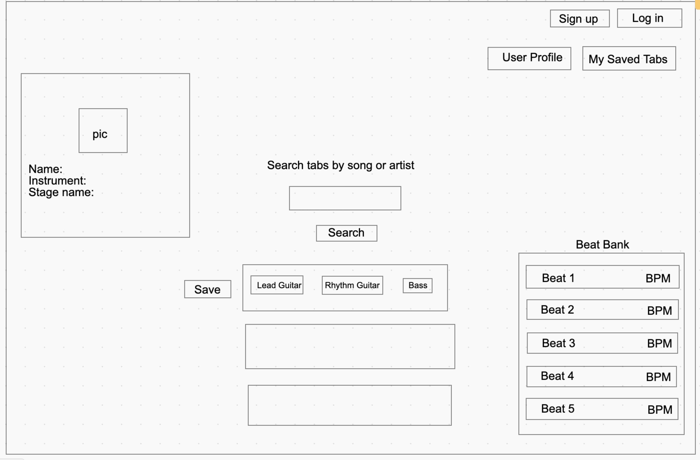
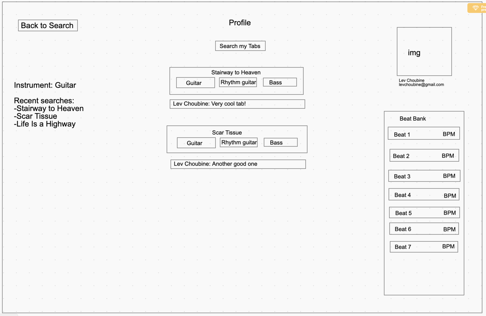
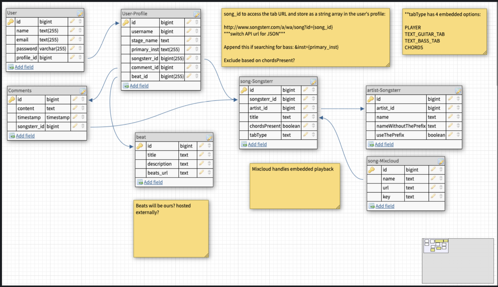

# Tab Sensei Proposal

Tab Sensei will be a tab search engine that allows users to easily search guitar tab notation for their favorite songs. Included will be a bank of stock beats that can be played from anywhere. Users will be able to save tabs for future reference and leave comments on individual tab results. Tab Sensei will store comments into the database based on the tab_id, so when a new user searches for tabs, they are able to read the comments that other users have left.

*and possibly check out the the profiles of those those who left the comment( *stretch goal). 
## User Stories:
- As a user I want to be able to log into my profile, upload my picture and update my profile information. 
- As a user I want to search for music tabs of songs I like, save tabs and leave comments.
- As a user I want to be able to see comments made by other users.
- As a user I want to be able to play along to a selection of stock beats provided by Tab Sensei

## Stetch Goals:
- Create a Beat Bank playback engine with drum beats to play along to with adjustable tempo. Having a variety of drum groove styles to select from is what makes the Tab Sensei expereince unique from other tab search engines.
- Enable users to message each other based on the comments found (example: Ariel commented on STAIRWAY TO HEAVEN: ”Hey guys, should I use a different tuning for this song?“// Tyler sees the comment when he pulls the tab up and responds: “This song was written in [E, B, G, D, A, E] - I wouldn’t mess with it, Dude”
- Provide Youtube videos with Tutorials
- Include information on guitar related products that is relevant to the user's interests (i.e. guitar picks, strings, capos, etc)

## Pre-build Wireframes and ERD
### Main page

### Profile page

### Database ERD
